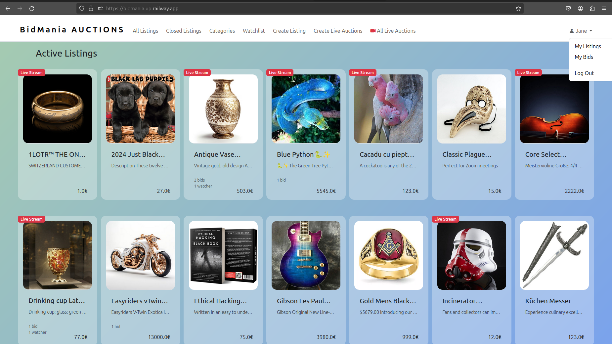
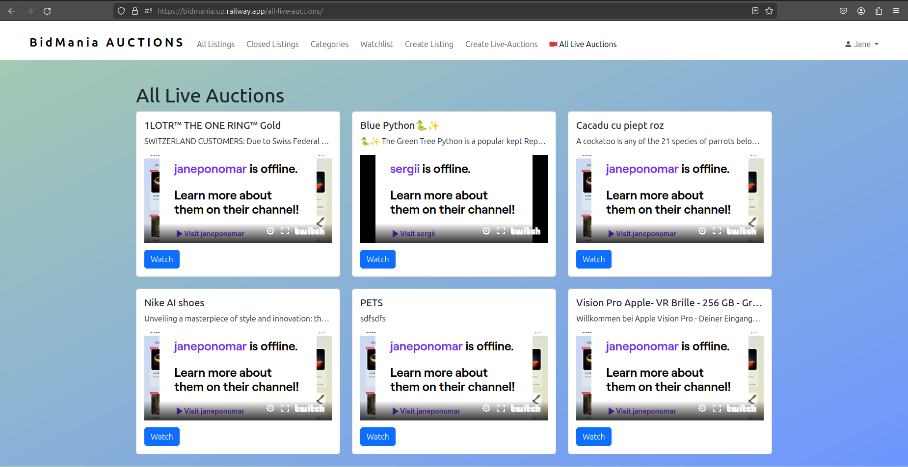
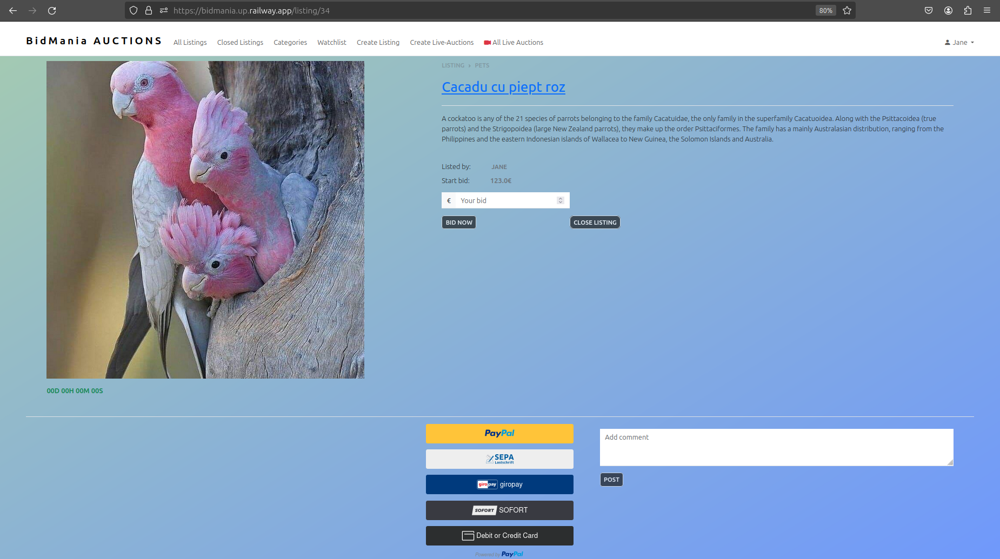
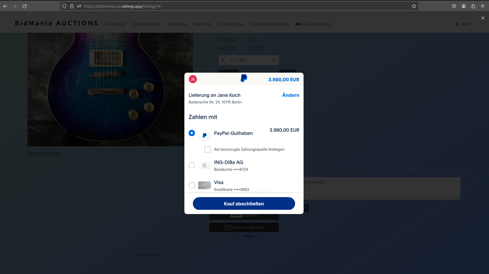

# REAL-TIME AUCTIONS

## BidMania: Live Real-Time Auction Experience
### Concept Overview:
#### BidMania is an innovative online platform that brings the thrill of live auctions to the digital realm. Users can participate in real-time auctions, watch engaging video shows, and bid on a variety of items to win exciting treasures. The platform aims to provide a dynamic and immersive auction experience with seamless payment options through PayPal and Stripe.

### Key Features:

#### 1. Live Video Shows:
- BidMania hosts live video shows where charismatic hosts showcase auction items, providing detailed insights and   entertaining commentary.
- Users can watch these shows in real-time, enhancing the excitement and engagement of the bidding process.





#### 2. Real-Time Bidding:

- Users can participate in live auctions, placing bids in real-time as the host presents each item.
- The platform ensures a fair and transparent bidding process, with instant updates on the current highest bid displayed during the live video shows.

#### 3. Diverse Auction Items:

- BidMania features a wide range of auction items, from electronics and collectibles to unique experiences, ensuring there's something for everyone.
- Auction items are carefully curated to appeal to a diverse audience, creating a vibrant and dynamic marketplace.





#### 4. User-Friendly Interface:

- The platform offers an intuitive and user-friendly interface, making it easy for users to navigate, browse items, and place bids effortlessly.
- Seamless integration of video streaming and bidding features enhances the overall user experience.


#### 5. Secure Payment Options:

- BidMania ensures secure transactions by integrating popular payment gateways such as PayPal.
- Users can complete their transactions quickly and confidently, adding a layer of trust to the auction experience.





#### BidMania aims to redefine the online auction experience by combining the excitement of live video shows with the convenience of real-time bidding, making it a go-to platform for auction enthusiasts worldwide.

## GET STARTED...

### git clone...
### open code in vscode and create a virtual environment:
```bash
    python3 -m venv venv

```
```bash
    source venv/bin/activate

```
```bash
    pip install -r requirements.txt

```
```bash
    python3 manage.py runserver

```


